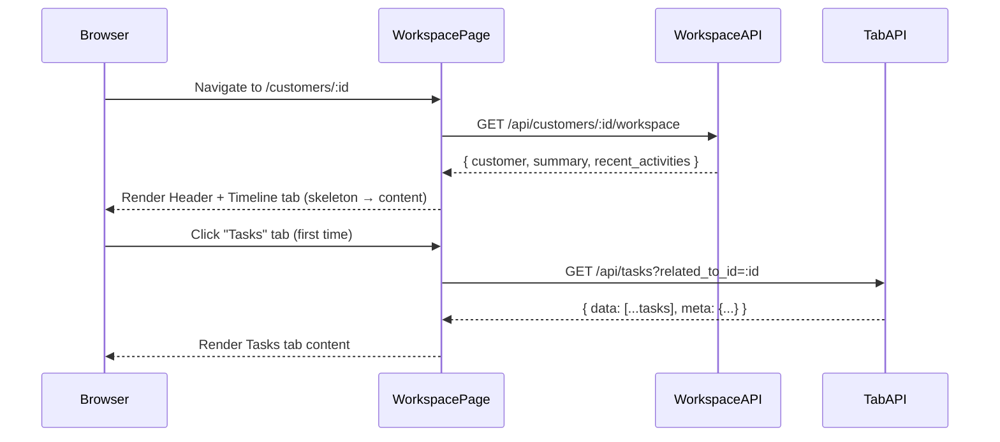

# Design Document — Unified Customer Workspace

## Overview

The Unified Customer Workspace replaces `CustomerDetailPage` with a single, comprehensive screen at `/customers/:id`. It eliminates context switching by surfacing the complete customer record — timeline, tasks, deals, follow-ups, notes, files, and analytics — within one two-panel layout backed by a single initial API request.

The design extends the existing Flask/MongoDB backend by adding one new aggregated endpoint (`GET /api/customers/:id/workspace`) and a new Flask Blueprint for file attachments. The frontend replaces the existing page component with a new `CustomerWorkspacePage` built from the existing UI primitive library, following the component and hook patterns already established across the app.

Key design decisions:
- A single aggregated workspace endpoint reduces waterfall API calls on page load.
- Tab content is lazy-loaded on first selection so the initial payload stays small.
- Notes are stored as `activities` with `type: "note"`, reusing `Activity_Service` — no new collection needed.
- Inline editing uses optimistic updates with rollback on failure.
- RBAC uses the existing `permission_required` middleware and `useAuth` context — no new permission model.

---

## Architecture

### High-Level Flow



### Component Hierarchy

```
CustomerWorkspacePage          (page, owns workspace state, data fetch)
├── WorkspaceHeader            (persistent, inline-edit fields, quick actions)
│   └── SlideOverPanel         (quick action form host — slide-over)
│       ├── NoteForm           (Add Note)
│       ├── TaskFormModal      (Create Task, pre-populated)
│       ├── DealFormModal      (Add Deal, pre-populated)
│       └── FollowUpFormModal  (Schedule Follow-up, pre-populated)
└── WorkspaceTabs              (tab bar + lazy tab panels)
    ├── TimelineTab            (infinite-scroll, type filter)
    ├── TasksTab               (grouped list, inline status toggle)
    ├── DealsTab               (sorted list, summary row)
    ├── FollowUpsTab           (sorted list, overdue indicator)
    ├── NotesTab               (filtered activities, inline edit)
    ├── FilesTab               (file list, upload, delete)
    └── AnalyticsTab           (client-computed metrics)
```

### State Management

No global state store is introduced. State lives at the `CustomerWorkspacePage` level and is passed down as props or via a lightweight `WorkspaceContext` (React context) for deeply nested components that need the customer ID or reload callbacks.

```
WorkspaceContext = {
  customerId,
  customer,        // from workspace API
  summary,         // { open_tasks, active_deals, pending_followups, lifetime_value }
  refreshSummary,  // re-fetches workspace endpoint to update header counts
  canWrite,        // boolean derived from useAuth role + assignment
}
```

Tab-level state (items, pagination, loading) stays local to each tab component using the existing `usePaginatedList` hook where applicable.

---

## Components and Interfaces

### Backend: New Workspace Endpoint

**Blueprint:** `workspace_bp` registered at `/api/customers/<customer_id>/workspace`

```python
# backend/app/routes/workspace_routes.py
GET /api/customers/<customer_id>/workspace
# Auth: permission_required("customers.read")
# Response envelope (success_response):
{
  "data": {
    "customer": { ...customer fields... },
    "recent_activities": [ ...20 most recent activity docs... ],
    "summary": {
      "open_tasks_count": int,
      "active_deals_count": int,
      "pending_followups_count": int,
      "lifetime_value": float
    }
  }
}
```

The endpoint delegates to a new `workspace_service.get_workspace_data(customer_id)` that runs four MongoDB queries in sequence and returns the aggregated dict. The queries are:
1. `customer_service.get_customer_by_id(customer_id)` — customer doc
2. `activity_service.list_activities_for_entity("customer", customer_id, skip=0, limit=20)` — recent timeline
3. `db.tasks.count_documents({"related_to.type": "customer", "related_to.id": customer_id, "status": {"$in": ["todo", "in_progress"]}})` — open task count
4. `db.deals.count_documents({"customer_id": customer_id, "status": "open"})` — active deal count
5. `db.followups.count_documents({"related_to.type": "customer", "related_to.id": customer_id, "status": "pending"})` — pending followup count

Lifetime value is read directly from the customer document.

**PATCH endpoint (already exists):**
```
PATCH /api/customers/<customer_id>
```
The existing `PUT /api/customers/<customer_id>` route will be augmented with a `PATCH` alias to support single-field inline edits. The `CustomerUpdateSchema` already allows partial fields.

**Files Blueprint:** New `files_bp` registered at `/api/customers/<customer_id>/files`

```
GET    /api/customers/<customer_id>/files          — list files
POST   /api/customers/<customer_id>/files          — upload (multipart/form-data)
DELETE /api/customers/<customer_id>/files/<file_id> — delete
```

Files are stored in a new `files` MongoDB collection:
```
{ _id, customer_id, filename, mimetype, size_bytes, storage_key, uploaded_by, created_at }
```
File binary is stored on the server filesystem (or object storage path) keyed by `storage_key`. A signed URL or direct `/api/files/<storage_key>` download route serves the file.

### Frontend: New API Client

```js
// frontend/src/api/workspaceApi.js
export const workspaceApi = {
  get: (id) => apiClient.get(`/customers/${id}/workspace`),
  patch: (id, payload) => apiClient.patch(`/customers/${id}`, payload),
  listFiles: (id) => apiClient.get(`/customers/${id}/files`),
  uploadFile: (id, formData) => apiClient.post(`/customers/${id}/files`, formData, {
    headers: { "Content-Type": "multipart/form-data" }
  }),
  deleteFile: (customerId, fileId) => apiClient.delete(`/customers/${customerId}/files/${fileId}`),
};
```

### Frontend: Key Hooks

**`useWorkspace(customerId)`** — fetches the workspace endpoint on mount, owns `customer`, `summary`, `recentActivities`, `loading`, `error`, and `retry` state.

**`useInlineEdit(customer, onSave)`** — manages per-field edit state: `editingField`, `draftValue`, `saving`, `fieldError`. Calls `workspaceApi.patch` on confirm, reverts on failure.

**`useTabLoad(tabKey, fetchFn)`** — wraps `usePaginatedList`; only fires `fetchFn` after the tab has been activated at least once (lazy-load pattern).

**`useKeyboardShortcuts(handlers, enabled)`** — attaches `keydown` listeners for N/T/D/F; ignores events when `e.target` is an input/textarea/[contenteditable].

### Frontend: SlideOverPanel

A new `SlideOverPanel` component anchored to the right side of the viewport. It renders above the workspace content without navigating away. Internally it uses a portal (`ReactDOM.createPortal`) to the `document.body` to avoid z-index issues with the sidebar.

```jsx
<SlideOverPanel open={boolean} onClose={fn} title="Add Note">
  {children}
</SlideOverPanel>
```

CSS transition: slides in from the right. Width: 420px on desktop, full-width on mobile. Overlay backdrop dims the workspace content but does not block the header.

### Frontend: WorkspaceHeader

Renders the customer identity row and the Quick Action bar.

Editable fields: `name`, `email`, `phone`, `company`, `status`, `assigned_to`, `tags`. Each field renders in display mode by default. On click, the field switches to an `<input>` or `<select>` in-place. On Enter or blur, `useInlineEdit.save(field, value)` is called.

Non-editable read-only fields: `lifetime_value` (displayed but computed from deals), `created_at`.

### Frontend: Tab Bar and URL Hash

The tab bar reads `window.location.hash` on mount and sets the active tab. On tab change, it calls `history.replaceState` (not `navigate`, to avoid adding browser history entries for tab switches within the same record). Shared links therefore restore the correct tab.

Tab labels with badges:
- Timeline (no badge)
- Tasks `[open count]`
- Deals `[open count]`
- Follow-ups `[pending count]`
- Notes (no badge)
- Files (no badge)
- Analytics (no badge)

Counts come from the `summary` object returned by the workspace API and are updated after any write operation via `refreshSummary`.

---

## Data Models

### Activity Document (existing, no change)

```json
{
  "_id": "ObjectId",
  "related_to": { "type": "customer", "id": "string" },
  "type": "note | created | task_created | task_status_change | deal_created | deal_moved | followup_scheduled | followup_completed | file_uploaded | file_deleted",
  "description": "string",
  "created_by": "string (user_id)",
  "created_at": "datetime",
  "extra": {}
}
```

Notes use `type: "note"` and store the note body in `description`. An optional `extra.edited_at` field is written on note edit.

### File Document (new collection: `files`)

```json
{
  "_id": "ObjectId",
  "customer_id": "string",
  "filename": "string",
  "mimetype": "string",
  "size_bytes": "integer",
  "storage_key": "string (UUID-based path)",
  "uploaded_by": "string (user_id)",
  "created_at": "datetime"
}
```

### Workspace API Response Shape

```json
{
  "success": true,
  "data": {
    "customer": {
      "_id": "string",
      "name": "string",
      "email": "string",
      "phone": "string",
      "company": "string",
      "status": "active | inactive | churned",
      "assigned_to": "string",
      "lifetime_value": 0.0,
      "tags": [],
      "created_at": "datetime",
      "updated_at": "datetime"
    },
    "recent_activities": [ ...activity docs... ],
    "summary": {
      "open_tasks_count": 0,
      "active_deals_count": 0,
      "pending_followups_count": 0,
      "lifetime_value": 0.0
    }
  }
}
```

### RBAC Mapping (read from existing `rbac.py`)

| Role    | Read | Create/Update | Delete |
|---------|------|---------------|--------|
| admin   | all  | all           | all    |
| manager | all  | all           | all    |
| agent   | all (own assigned) + read-only others | own assigned only | no |

The `canWrite` boolean in `WorkspaceContext` is derived as:
```js
canWrite = isAdmin || isManager || (isAgent && customer.assigned_to === user.id)
```

---

## Correctness Properties

*A property is a characteristic or behavior that should hold true across all valid executions of a system — essentially, a formal statement about what the system should do. Properties serve as the bridge between human-readable specifications and machine-verifiable correctness guarantees.*

### Property 1: Header fields always present

*For any* customer record, the rendered `WorkspaceHeader` must include the customer's name, company, email, phone, status, assigned owner, tags, and lifetime value — regardless of which tab is currently active.

**Validates: Requirements 1.2, 3.1**

---

### Property 2: Tab-hash round-trip

*For any* valid tab key in `["timeline", "tasks", "deals", "followups", "notes", "files", "analytics"]`, activating that tab must update `window.location.hash` to `#<tab-key>`, and loading the page with that hash must restore the same active tab.

**Validates: Requirements 1.5**

---

### Property 3: Workspace API response shape

*For any* customer that exists in the database, `GET /api/customers/:id/workspace` must return a response containing all of: `customer` object, `recent_activities` array (at most 20 entries), and `summary` object with `open_tasks_count`, `active_deals_count`, `pending_followups_count`, and `lifetime_value` fields.

**Validates: Requirements 2.1**

---

### Property 4: Tab lazy-load on first activation

*For any* tab other than Timeline, selecting it for the first time must trigger exactly one API call for that tab's resource. Selecting the same tab again must not re-fetch (unless an explicit refresh is requested).

**Validates: Requirements 2.4**

---

### Property 5: Inline field edit round-trip

*For any* editable header field and any valid value, clicking the field must render an input in place, and confirming the edit must call `PATCH /api/customers/:id` with the updated field and reflect the new value in the header without a page reload.

**Validates: Requirements 3.2, 3.3**

---

### Property 6: Quick-action slide-over without navigation

*For any* of the four Quick Action buttons (Add Note, Create Task, Add Deal, Schedule Follow-up), activating it must open the `SlideOverPanel` and the browser URL must remain at `/customers/:id` after the panel opens.

**Validates: Requirements 3.6**

---

### Property 7: Timeline sorted newest-first

*For any* customer, the timeline entries returned and rendered must be ordered by `created_at` descending — no entry with an earlier `created_at` should appear before an entry with a later `created_at`.

**Validates: Requirements 4.1**

---

### Property 8: Timeline entry rendering completeness

*For any* activity record in the timeline, the rendered entry must include an activity type icon, the description text, the actor's name, and a relative timestamp (e.g. "2 hours ago").

**Validates: Requirements 4.2**

---

### Property 9: All supported activity types render without error

*For any* activity whose `type` is one of `created`, `note`, `task_created`, `task_status_change`, `deal_created`, `deal_moved`, `followup_scheduled`, `followup_completed`, `file_uploaded`, `file_deleted`, the timeline entry component must render without throwing an error and must display a non-empty icon.

**Validates: Requirements 4.4**

---

### Property 10: Timeline type filter

*For any* activity type filter value applied to the timeline, every rendered entry must have a `type` equal to the selected filter value, and removing the filter must show all types again.

**Validates: Requirements 4.6**

---

### Property 11: Note creation round-trip

*For any* non-empty note body, submitting via the "Add Note" action must create an activity record with `type: "note"`, the body in `description`, the current customer's ID in `related_to.id`, and the authenticated user's ID in `created_by` — and that record must be retrievable from the activities API.

**Validates: Requirements 5.1, 5.2**

---

### Property 12: Notes tab shows only note-type activities, sorted newest-first

*For any* customer, the Notes tab must display only activity records where `type == "note"`, and those entries must be sorted by `created_at` descending with no non-note entries interspersed.

**Validates: Requirements 5.3**

---

### Property 13: Note rendering completeness

*For any* note activity, the rendered note card in the Notes tab must display the full note body, the author's name, and an absolute timestamp.

**Validates: Requirements 5.4**

---

### Property 14: Note edit persisted with audit log

*For any* existing note, saving an inline edit must update the `description` field of the activity record in the database and write an entry in `audit_logs` recording the change.

**Validates: Requirements 5.6**

---

### Property 15: Empty note rejected before API call

*For any* string composed entirely of whitespace characters, submitting it as a note body must be rejected client-side with a validation message, and no API call must be made.

**Validates: Requirements 5.7**

---

### Property 16: Tasks tab filtered to current customer

*For any* customer, the Tasks tab must display only tasks where `related_to.type == "customer"` and `related_to.id == customer._id`. No tasks belonging to other entities must appear.

**Validates: Requirements 6.1**

---

### Property 17: Task rendering completeness

*For any* task displayed in the Tasks tab, the rendered row must include the task title, status badge, priority badge, due date, and assigned owner.

**Validates: Requirements 6.2**

---

### Property 18: Task grouping by open/completed status

*For any* set of tasks for a customer, tasks with status in `["todo", "in_progress"]` must appear in the "Open" group, and tasks with status in `["completed", "cancelled"]` must appear in the "Completed" group. No task must appear in both groups or in neither group.

**Validates: Requirements 6.3**

---

### Property 19: Task status cycle on badge click

*For any* task with a given status, clicking the status badge must compute the next status in the cycle (`todo → in_progress → completed → todo`) and call `PATCH /api/tasks/:id` with the new status value.

**Validates: Requirements 6.4**

---

### Property 20: Task creation triggers customer activity

*For any* task created with `related_to_type == "customer"`, the backend must create an activity record of type `task_created` linked to that customer, retrievable from the customer's activity timeline.

**Validates: Requirements 6.6**

---

### Property 21: Tasks count badge matches open task count

*For any* customer, the count badge on the Tasks tab label must equal the number of tasks where `related_to` matches the customer and `status` is in `["todo", "in_progress"]`.

**Validates: Requirements 6.7**

---

### Property 22: Deals tab filtered to current customer

*For any* customer, the Deals tab must display only deals where `customer_id == customer._id`. No deals belonging to other customers must appear.

**Validates: Requirements 7.1**

---

### Property 23: Deal rendering completeness

*For any* deal displayed in the Deals tab, the rendered row must include the deal title, stage name, value, status badge, assigned owner, and expected close date.

**Validates: Requirements 7.2**

---

### Property 24: Deals sorted open → won → lost

*For any* set of deals for a customer, open deals must appear before won deals, and won deals must appear before lost deals in the rendered list.

**Validates: Requirements 7.3**

---

### Property 25: Deal summary aggregations are correct

*For any* set of deals for a customer, the summary row must show: total value of `status == "open"` deals, total value of `status == "won"` deals, and count of deals for each status — all matching the sum/count computed from the deals array.

**Validates: Requirements 7.5**

---

### Property 26: Open deals count badge accuracy

*For any* customer, the count badge on the Deals tab must equal the number of deals where `customer_id` matches and `status == "open"`.

**Validates: Requirements 7.7**

---

### Property 27: Follow-ups tab filtered to current customer

*For any* customer, the Follow-ups tab must display only follow-ups where `related_to.type == "customer"` and `related_to.id == customer._id`.

**Validates: Requirements 8.1**

---

### Property 28: Follow-up rendering completeness

*For any* follow-up displayed in the Follow-ups tab, the rendered row must include the title, type icon, due date, status badge, and assigned owner.

**Validates: Requirements 8.2**

---

### Property 29: Follow-ups sorted pending/overdue first by due_date

*For any* set of follow-ups, all items with `status` in `["pending", "overdue"]` must appear before items with other statuses, and within each group items must be sorted by `due_date` ascending.

**Validates: Requirements 8.3**

---

### Property 30: Overdue indicator on past-due pending follow-ups

*For any* follow-up where `due_date < now` and `status == "pending"`, the rendered row must include a visible overdue indicator element. Follow-ups that are not overdue must not show the indicator.

**Validates: Requirements 8.4**

---

### Property 31: Pending follow-ups count badge accuracy

*For any* customer, the count badge on the Follow-ups tab must equal the number of follow-ups where `related_to` matches the customer and `status == "pending"`.

**Validates: Requirements 8.7**

---

### Property 32: File rendering completeness

*For any* file record associated with a customer, the rendered row in the Files tab must include the filename, a file type icon, the file size, the upload date, and the uploader's name.

**Validates: Requirements 9.1**

---

### Property 33: File upload client-side validation

*For any* file whose size exceeds 25 MB, the upload must be rejected client-side before any API call is made, with an error message displayed. *For any* file whose MIME type is not in the accepted list (PDF, DOCX, XLSX, PNG, JPG, CSV), the upload must similarly be rejected client-side with a message listing supported formats.

**Validates: Requirements 9.4, 9.5**

---

### Property 34: File deletion records activity

*For any* file associated with a customer, completing the deletion flow (confirm → API call → success) must remove the file from the displayed list and create an activity record of type `file_deleted` linked to the customer.

**Validates: Requirements 9.7**

---

### Property 35: Analytics metrics match underlying data

*For any* customer, the metrics displayed in the Analytics tab — total lifetime value, count of won deals, count of lost deals, count of open deals, average won deal value, total completed tasks, total completed follow-ups, and days since last activity — must equal the values computed by aggregating the data returned by the existing deals, tasks, follow-ups, and activities APIs for that customer.

**Validates: Requirements 10.1, 10.4**

---

### Property 36: Keyboard shortcuts trigger correct actions

*For any* keyboard shortcut key in `{N: "Add Note", T: "Create Task", D: "Add Deal", F: "Schedule Follow-up"}`, pressing the key while the workspace is focused and no text input element is focused must open the corresponding slide-over panel.

**Validates: Requirements 11.1**

---

### Property 37: Shortcuts suppressed when text input is focused

*For any* shortcut key and any focused `<input>`, `<textarea>`, or `[contenteditable]` element, pressing the shortcut must not open the Quick Action panel.

**Validates: Requirements 11.2**

---

### Property 38: Shortcut hint tooltips present on Quick Action buttons

*For any* Quick Action button, the rendered button must include a `title` attribute or tooltip element containing the associated keyboard shortcut hint.

**Validates: Requirements 11.3**

---

### Property 39: RBAC controls write access by role

*For any* user with the `agent` role viewing a customer not assigned to them, all write Quick Action buttons must be hidden and any direct write API call must result in a permission denied error displayed to the user with any optimistic UI changes reverted. *For any* user with the `admin` or `manager` role, all write actions must be permitted on all customer records.

**Validates: Requirements 12.1, 12.2, 12.3, 12.4**

---

## Error Handling

### Network and API Errors

| Scenario | Behavior |
|----------|----------|
| Workspace API request fails on mount | Full-page error state with retry button; no crash |
| Inline edit PATCH fails | Revert field to previous value; show inline error message adjacent to the field |
| Tab lazy-load fails | Show an error banner inside the tab panel with a retry link; other tabs unaffected |
| Note/task/deal/follow-up creation fails | Toast error from `ToastContext`; slide-over remains open so the user does not lose their input |
| File upload fails (server error) | Error toast; file does not appear in list |
| Permission denied (403) from any write API | Permission denied message displayed; optimistic UI updates reverted |
| Customer not found (404) on workspace load | Redirect to `/customers` with a toast notification |

### Validation Errors (Client-Side)

- Empty note body → reject before API call, display inline field error
- File > 25 MB → reject before API call, display size error
- Invalid file type → reject before API call, display accepted formats list
- Inline edit value that fails schema (e.g. invalid email format) → show inline error, do not call API

### Optimistic Updates

The following operations use optimistic updates:

1. **Timeline note prepend** — new note is prepended to the timeline immediately; if the API fails, the prepended entry is removed.
2. **Task status cycle** — status badge updates immediately; if PATCH fails, the previous status is restored.
3. **Follow-up complete** — row updates to "completed" immediately; if PATCH fails, the previous status is restored.
4. **File upload** — a placeholder row with a progress indicator is added immediately; on failure it is removed.
5. **Inline field edit** — field shows new value immediately; on PATCH failure, the previous value is restored.

All optimistic reverts also display a toast error via `ToastContext`.

---

## Testing Strategy

### Dual Testing Approach

Both unit tests and property-based tests are required. Unit tests cover specific examples, integration points, and error conditions. Property tests verify universal correctness across randomized inputs. Together they provide comprehensive coverage.

### Unit Tests

Unit tests focus on:
- Specific examples: workspace API response shape for a known fixture customer
- Integration points: `workspace_service.get_workspace_data` correctly assembles from four queries
- Error conditions: 404 on unknown customer ID, permission denied for wrong role
- UI edge cases: overdue indicator appears for past-due pending follow-up, empty note submission blocked
- Snapshot rendering of each tab with fixture data

Backend unit tests use `pytest` (already present in `backend/tests/`). Frontend unit tests use `vitest` + `@testing-library/react` (check `frontend/package.json` for existing test setup).

### Property-Based Tests

**Property-based testing library:**
- Backend (Python): `hypothesis`
- Frontend (JavaScript): `fast-check`

**Configuration:** Each property test must run a minimum of **100 iterations**.

**Tag format for each test:**
```
Feature: unified-customer-workspace, Property <N>: <property_text>
```

Each property listed in the Correctness Properties section maps to exactly one property-based test.

**Backend property test examples:**

```python
# Feature: unified-customer-workspace, Property 3: Workspace API response shape
@given(customer=st.from_model(CustomerFixture))
@settings(max_examples=100)
def test_workspace_response_shape(client, customer):
    resp = client.get(f"/api/customers/{customer['_id']}/workspace")
    data = resp.json["data"]
    assert "customer" in data
    assert "recent_activities" in data
    assert "summary" in data
    summary = data["summary"]
    assert all(k in summary for k in ["open_tasks_count", "active_deals_count", "pending_followups_count", "lifetime_value"])
```

```python
# Feature: unified-customer-workspace, Property 15: Empty note rejected before API call
@given(body=st.text(alphabet=st.characters(whitelist_categories=("Zs",)), min_size=0, max_size=50))
@settings(max_examples=100)
def test_empty_note_rejected(body):
    result = validate_note_body(body)
    assert result is False
```

**Frontend property test examples:**

```js
// Feature: unified-customer-workspace, Property 7: Timeline sorted newest-first
test.prop([fc.array(activityArbitrary(), { minLength: 0, maxLength: 50 })])(
  'timeline entries are sorted by created_at descending',
  (activities) => {
    const sorted = sortTimeline(activities);
    for (let i = 0; i < sorted.length - 1; i++) {
      expect(new Date(sorted[i].created_at) >= new Date(sorted[i + 1].created_at)).toBe(true);
    }
  }
);
```

```js
// Feature: unified-customer-workspace, Property 18: Task grouping by open/completed status
test.prop([fc.array(taskArbitrary(), { minLength: 0, maxLength: 30 })])(
  'tasks are grouped correctly by status',
  (tasks) => {
    const { open, completed } = groupTasksByStatus(tasks);
    const openStatuses = new Set(['todo', 'in_progress']);
    const completedStatuses = new Set(['completed', 'cancelled']);
    expect(open.every(t => openStatuses.has(t.status))).toBe(true);
    expect(completed.every(t => completedStatuses.has(t.status))).toBe(true);
    expect(open.length + completed.length).toBe(tasks.length);
  }
);
```

```js
// Feature: unified-customer-workspace, Property 25: Deal summary aggregations are correct
test.prop([fc.array(dealArbitrary(), { minLength: 0, maxLength: 20 })])(
  'deal summary totals match computed values',
  (deals) => {
    const summary = computeDealSummary(deals);
    const expectedOpenValue = deals.filter(d => d.status === 'open').reduce((s, d) => s + d.value, 0);
    const expectedWonValue = deals.filter(d => d.status === 'won').reduce((s, d) => s + d.value, 0);
    expect(summary.openValue).toBeCloseTo(expectedOpenValue);
    expect(summary.wonValue).toBeCloseTo(expectedWonValue);
  }
);
```

```js
// Feature: unified-customer-workspace, Property 33: File upload client-side validation
test.prop([fc.integer({ min: 26 * 1024 * 1024 })])(
  'files over 25MB are rejected before API call',
  (size) => {
    const result = validateFile({ size, type: 'application/pdf' });
    expect(result.valid).toBe(false);
    expect(result.error).toMatch(/25\s*MB/i);
  }
);
```
